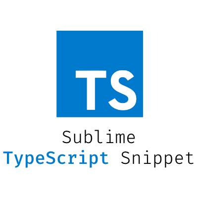

# Typescript Sublime Snippets

## Introduction

[Typescript](https://typescriptlang.org/) is a typed superset of JavaScript that compiles to plain JavaScript.
This repository was built to help developers in their day-to-day development of components in Typescript.

## Installation

1. Open Package Control - (Ctrl or ⌘) + ⇧ + P
2. Type `Typescript Snippets` and press Enter
3. Ready to use 🎉

## Snippets

### Typescript

| Snippet | Purpose |
| --- | --- |
| `tbase` | Single file component base |

## License

**Sublime Typescript Snippets** is open-sourced software licensed under the \[MIT license\](http://opensource.org/licenses/MIT)

Created with ♥️ by [@mauroreisvieira](https://twitter.com/mauroreisvieira) in **Portugal**
